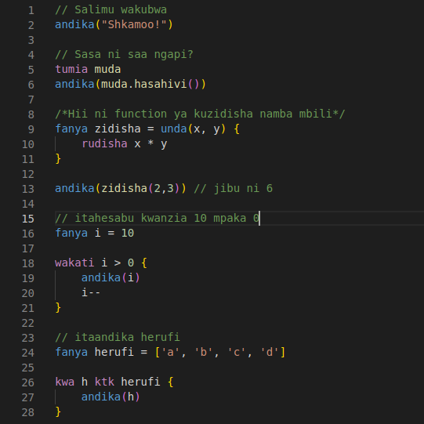

# Nuru VSCode Extension

This is a syntax highliting extension for Nuru on vscode. It detects `.nr` and `.sw` files.

## Screenshots

## How To Install

### Download From Market Place

- Simply download the Nuru Extension from VSCode Market Place

### Windows

- Copy the whole [nuru folder](https://github.com/NuruProgramming/Nuru/tree/main/extensions/vscode/nuru) and paste it in the VSCode extensions directory found in `%USERPROFILE%\.vscode\extensions`
- Restart VSCode

### Linux and MacOS

- Copy the whole [nuru folder](https://github.com/NuruProgramming/Nuru/tree/main/extensions/vscode/nuru) and paste it in the VSCode extensions directory found in `~/.vscode/extensions`
- Restart VSCode
